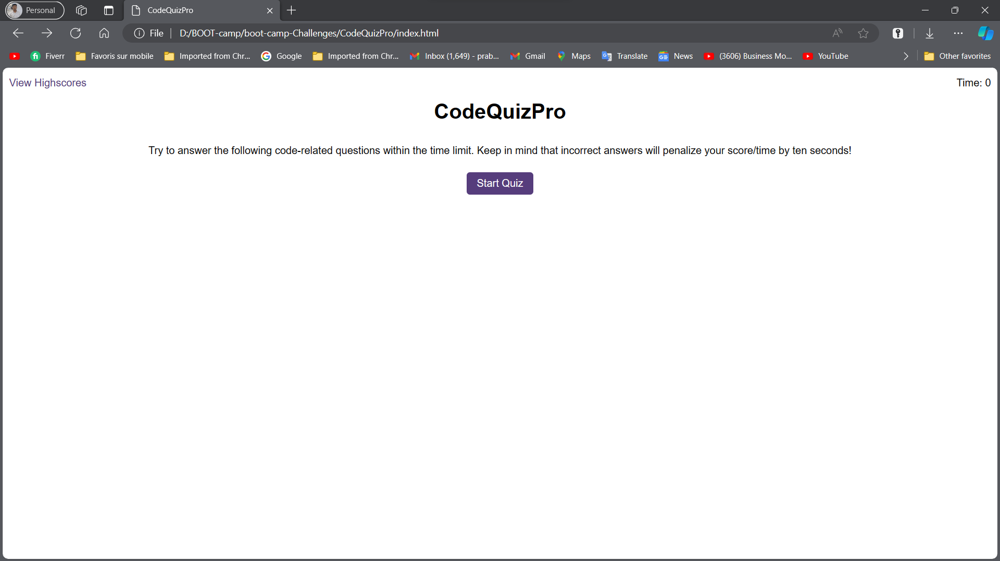

# Code Quiz Pro

Code Quiz Pro is a dynamic and responsive coding quiz app with timed multiple-choice questions, high score tracking, and a polished user interface.

## Overview

This project is a coding quiz application where users can test their knowledge by answering a series of questions related to programming. The app is built using HTML, CSS, and JavaScript.

## Features

- Interactive quiz interface.
- Timed multiple-choice questions.
- High score tracking.
- Polished user interface.

## Mock-Up



## Getting Started

1. Clone the repository:

   - Using HTTPS:
     ```bash
     git clone https://github.com/prabud0401/CodeQuizPro.git
     ```

   - Using SSH:
     ```bash
     git clone git@github.com:prabud0401/CodeQuizPro.git
     ```

2. Open the `index.html` file in your browser.

## Usage

- Click the "Start Quiz" button to begin the quiz.
- Answer each question within the time limit.
- Get feedback on correct or incorrect answers.
- View your final score at the end.
- Optionally, submit your high score.

## Deployed Application

Access the deployed application [here](https://prabud0401.github.io/CodeQuizPro/).

## Built With

- HTML
- CSS
- JavaScript


## License

This project is licensed under the [MIT License](LICENSE).

## Acknowledgments

- Special thanks to the teaching instructor for their invaluable guidance, support, and [specific contribution] throughout the development of this project. Their expertise and insights have been instrumental in shaping the success of Code Quiz Pro.
